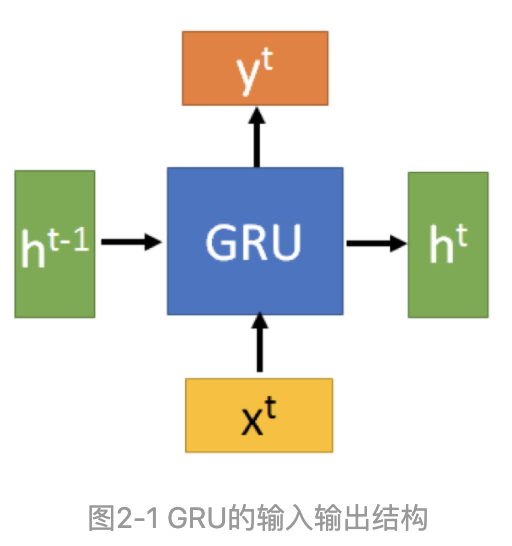
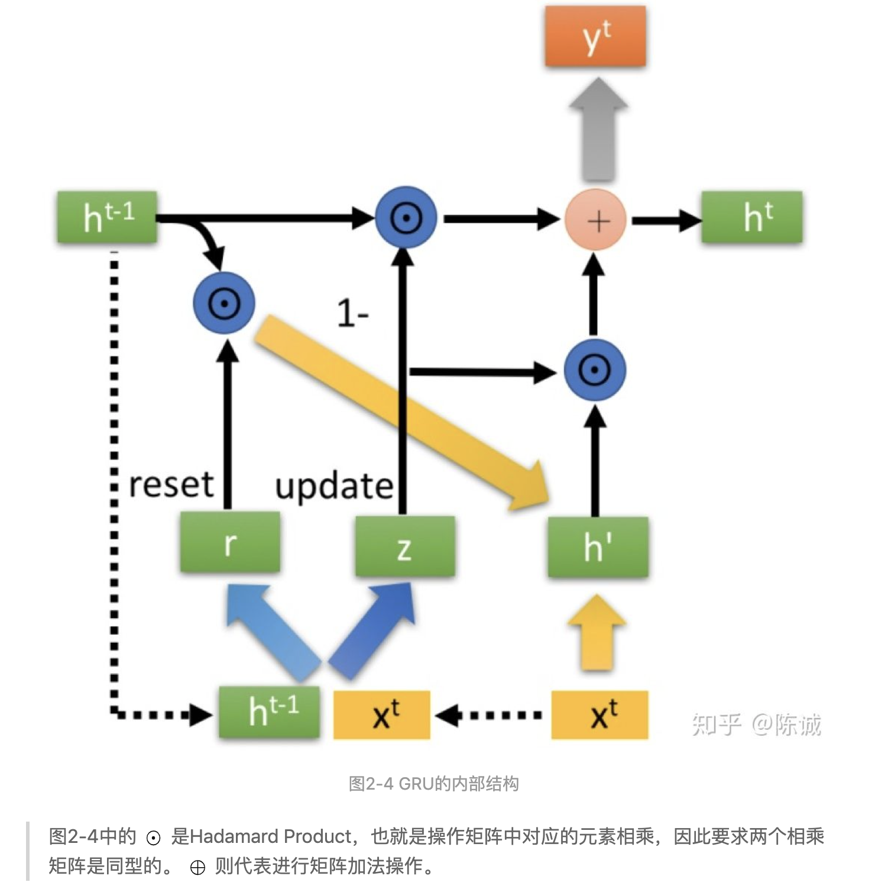
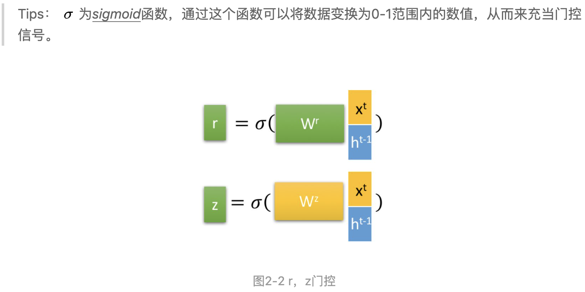
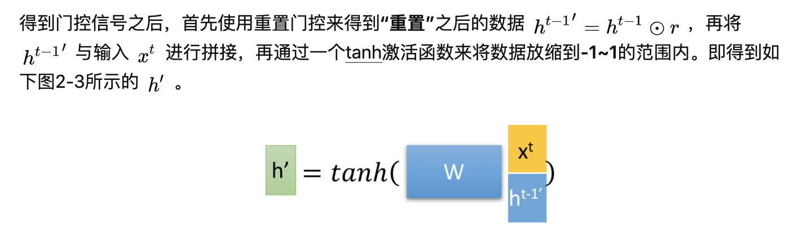
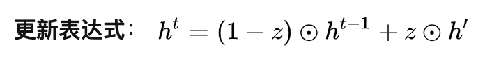
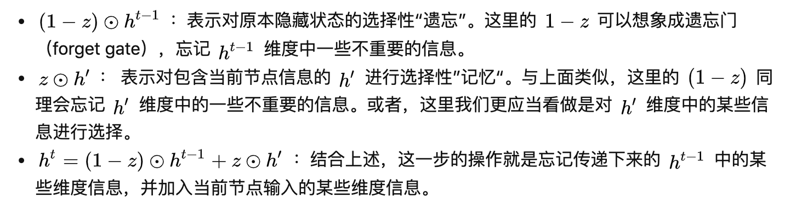

# 什么是GRU

GRU（Gate Recurrent Unit）是循环神经网络（Recurrent Neural Network, RNN）的一种。和LSTM（Long-Short Term
Memory）一样，也是为了解决长期记忆和反向传播中的梯度等问题而提出来的。 相比LSTM，使用GRU能够达到相当的效果，并且相比之下更容易进行训练，能够很大程度上提高训练效率，因此很多时候会更倾向于使用GRU。

# GRU浅析

## GRU的输入输出结构

GRU的输入输出结构与普通的RNN是一样的。

- 有一个当前的输入 xt ，和上一个节点传递下来的隐状态（hidden state） ht-1，这个隐状态包含了之前节点的相关信息。
- 结合 xt 和 ht-1，GRU会得到当前隐藏节点的输出 yt和传递给下一个节点的隐状态 ht 。

## GRU的内部结构

## 门状态

首先，我们先通过上一个传输下来的状态 ht-1 和当前节点的输入xt. 来获取两个门控状态。如下图2-2所示，其中

- r 为控制重置的门控（reset gate），
- z 为控制更新的门控（update gate）。

## 重置隐状态

这里的 h'主要是包含了当前输入的 xt 数据。有针对性地将h' 添加到当前的隐藏状态，相当于”记忆了当前时刻的状态“。类似于LSTM的选择记忆阶段。

## 更新记忆

在这个阶段，我们同时进行了遗忘了记忆两个步骤。我们使用了先前得到的更新门控 z（update gate）。

首先再次强调一下，门控信号（这里的 z）的范围为0~1。门控信号越接近1，代表”记忆“下来的数据越多；而越接近0则代表”遗忘“的越多。 GRU很聪明的一点就在于，我们使用了同一个门控
z就同时可以进行遗忘和选择记忆（LSTM则要使用多个门控）。

可以看到，这里的遗忘 1-z 和选择 z 是联动的。也就是说，对于传递进来的维度信息，我们会进行选择性遗忘，则遗忘了多少权重 （1-z ），我们就会使用包含当前输入的 ht中所对应的权重进行弥补 。以保持一种”恒定“状态。

# LSTM与GRU的关系

GRU是在2014年提出来的，而LSTM是1997年。他们的提出都是为了解决相似的问题，那么GRU难免会参考LSTM的内部结构。 大家看到r (reset gate)实际上与他的名字有点不符。我们仅仅使用它来获得了 h' 。

- 那么这里的 h‘实际上对应于LSTM中的hidden state；
- 上一个节点传下来的 ht-1则对应于LSTM中的cell state
- 1-z对应的则是LSTM中的 zf(forget gate)，
- 那么 z似乎就可以看成是选择门 zi

GRU输入输出的结构与普通的RNN相似，其中的内部思想与LSTM相似。
与LSTM相比，GRU内部少了一个”门控“，参数比LSTM少，但是却也能够达到与LSTM相当的功能。考虑到硬件的计算能力和时间成本，因而很多时候我们也就会选择更加”实用“的GRU。

