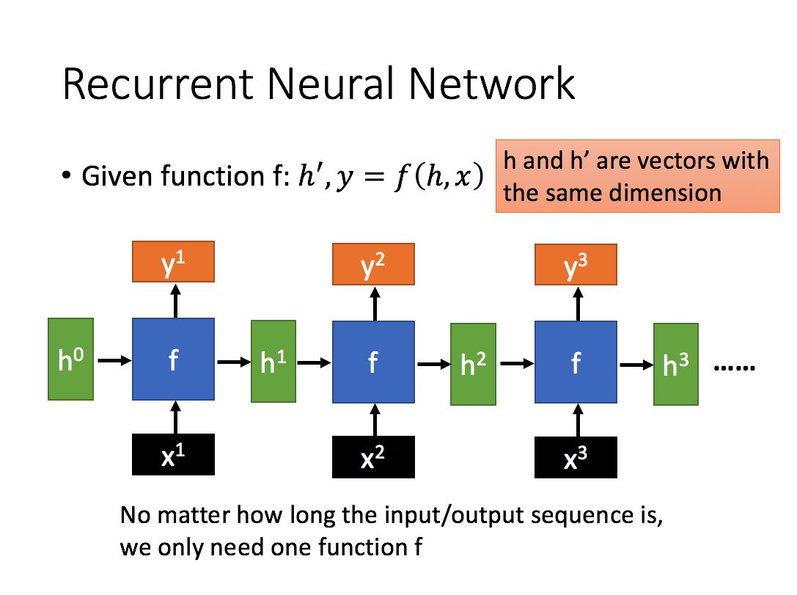
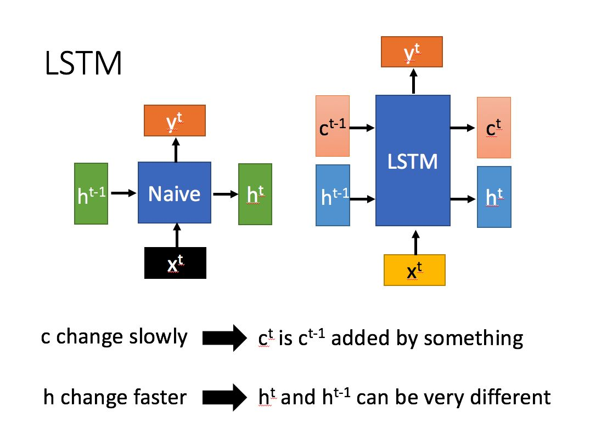
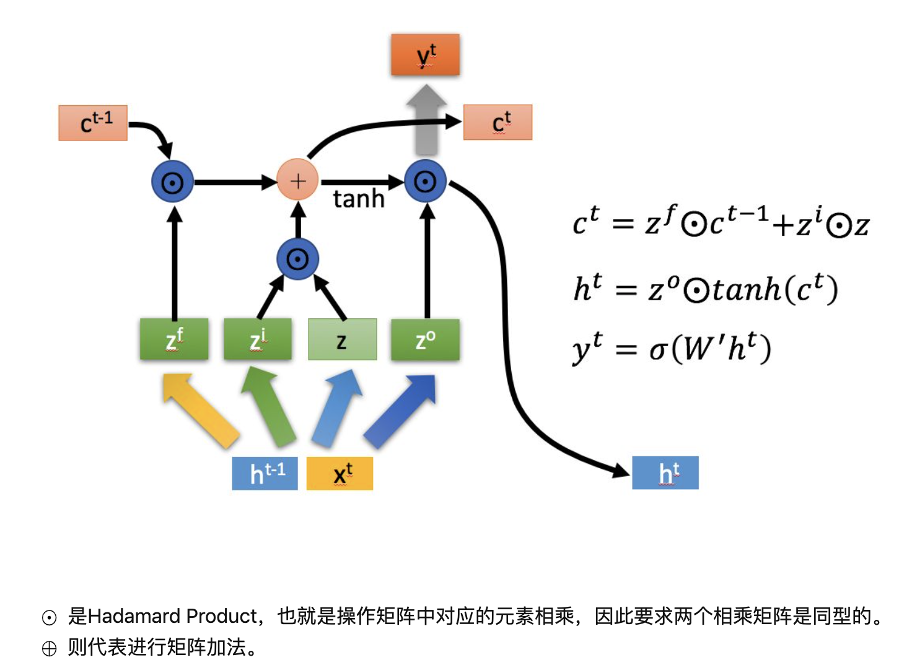
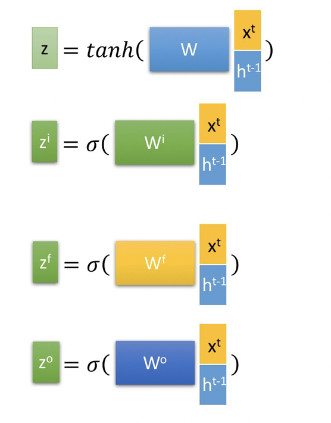

[TOC]

在NLP中， 一句话通常包含几十个词，这也意味着RNN的层数需要几十层，这会带来两个问题：
 - 梯度消失问题。
 - 长期依赖问题。
RNN由于这两大问题在实际应用中很少使用， 而LSTM通过门机制完美的解决了这两个问题。

# LSTM的思想
思想：普通RNN的隐层只有一个状态，如h，该状态对短期的输入十分敏感，这使得RNN处理短期依赖问题很拿手，那么如果我们再添加一个状态，如c，让它来保存长期的状态，这样，我们不就能保证对长期的输入保持一定的敏感，问题不就解决了。


# LSTM模型

下图是一个普通RNN模型与LSTM模型对比。
- RNN模型，激活函数采用tanh

  
- LSTM模型

  
**可以看到，在某一时刻t，LSTM的输入有三个**，分别是：

- 当前网络的输入值： xt
- 上一时刻LSTM的输出值： ht-1
- 上一时刻的单元状态： ct-1

**LSTM的输出有两个**，分别是：
- 当前时刻t，LSTM 的输出值： yt
- 当前时刻的单元状态： ct
- 简单来说，一个LSTM单元的计算就是通过 xt, ht-1,  ct-t 输出 yt，ct


# 深入LSTM结构
一个LSTM的cell如下示意图


首先使用LSTM的当前输入xt和ht-1拼接训练得到四个状态。

其中，zf,zi,zo是由拼接向量乘以权重矩阵之后，再通过一个sigmoid激活函数转换成0到1之间的数值，来作为一种门控状态。
而 z 则是将结果通过一个 tanh 激活函数将转换成-1到1之间的值（这里使用 tanh 是因为这里是将其做为输入数据，而不是门控信号）。

LSTM内部主要有四个阶段：

## 1. 忘记阶段。这个阶段主要是对上一个节点传进来的输入进行选择性忘记。简单来说就是会 “忘记不重要的，记住重要的”。
具体来说是通过计算得到的zf(f for forget)来作为忘记门控，来控制上一个状态的 ct-1哪些需要忘记

## 2. 选择记忆阶段。这个阶段将这个阶段的输入有选择性地进行“记忆”。
主要是会对输入xt进行选择记忆。哪些重要则着重记录下来，哪些不重要，则少记一些。
当前的输入内容由前面计算得到的z得到
而选择的门控信号则是由zi(i for input)来进行控制。
将上面两步得到的结果相加，即可得到传输给下一个状态的 ct

## 3.输出阶段。这个阶段将决定哪些将会被当成当前状态的输出。
主要是通过zo（o for output）控制，并且还对上一阶段得到的co进行了放缩（通过一个tanh激活函数进行变化）。

## 4. 与普通RNN类似，输出yt往往也是通过ht的变化得到的


# 门的概念
门实际上就是一层全连接层，它的输入是一个向量或多个向量，输出是一个0到1之间的数字。
我们可以这样理解，如果门的输出是0，就表示将门紧紧关闭，为1则表示将门完全打开，而位于0-1之间的实数表示将门半开，至于开的幅度跟这个数的大小有关。

结合到深度学习中，门就表示变量对变量的的影响程度。如果用W表示门的权重向量，b表示偏置项，那么门可以表示为：

```math
 g(x) =  sigmoid( Wx + b)
```

这个数就是介于0-1之间的数字。

当门输出为0时，任何向量与之相乘都会得到0向量，这就相当于啥都不能通过；输出为1时，任何向量与之相乘都不会有任何改变，这就相当于啥都可以通过。在深度学习中， 门是一个很重要的思想， 应用也极为广泛， 从embedding 到Attention 甚至在ensemble model中都有使用。